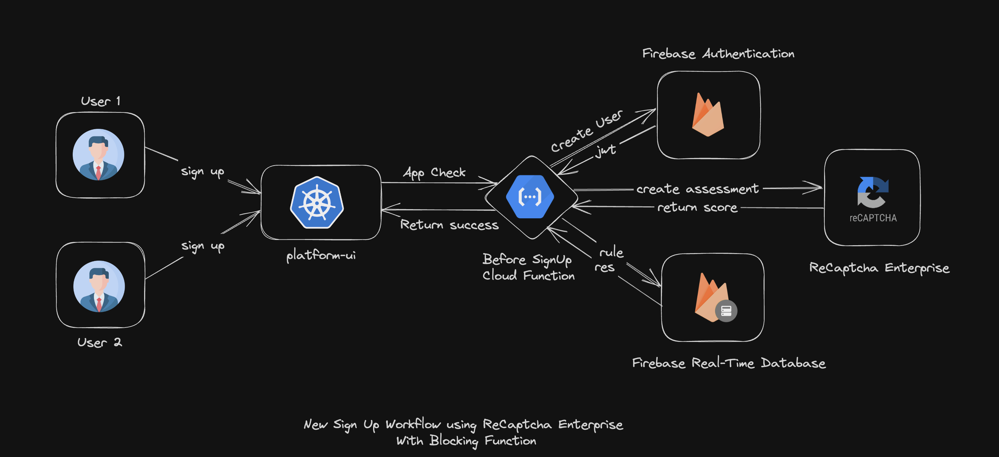

# firebase-recaptcha-function
Implementing score based authentication using Recaptcha Enterprise, Firebase and Cloud Functions

## HLD
The High Level Diagram for the above implementation is given below:

## Pre-Requisites:
To setup the project you will need:

1. node.js `>=18.7.0`

2. npm `>=18.7.0`

3. Recaptcha Enterprise setup on [`Google Cloud`](https://cloud.google.com/recaptcha-enterprise/docs/overview)

4. Firebase project with an existing App with Identity Platform enabled

5. Firebase admin sdk service account json key

## Setup and Run:
To setup the project locally, just clone the repo:

    git clone git@github.com:limebrew-org/firebase-recaptcha-function.git

Create a `.env` in root of the project and add the following environment variables:

    GOOGLE_APPLICATION_CREDENTIALS="path-to-firebase-admin-service-account"
    RECAPTCHA_SITE_KEY=your-site-key
    GCLOUD_PROJECT_ID=your-google-cloud-firebase-project-id

Once setup, run the following command to install the dependencies:

    npm install

Once all the dependencies are installed locally under `node_modules`, run the server:

    npm run start

## Contributing:
We acknowledge all kinds of contributions that makes this project more accessible to others
To contribute to this repo, just create a Pull Request to `main` branch.